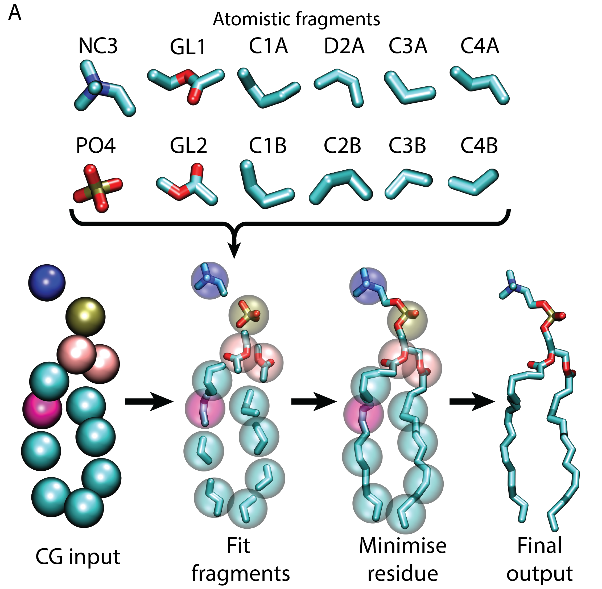
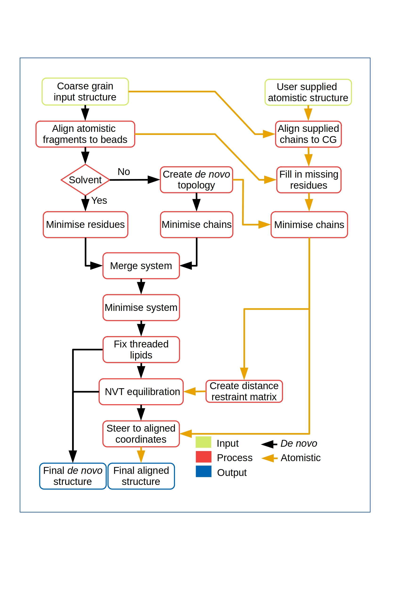
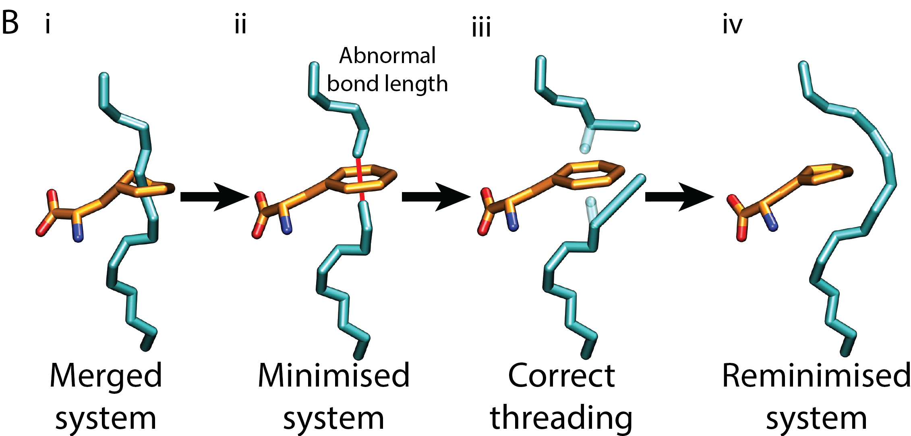
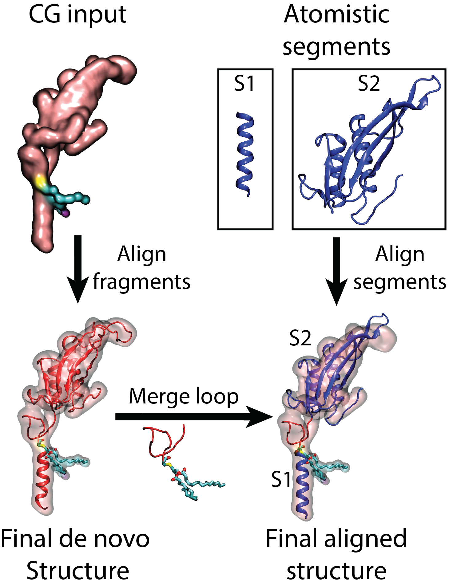
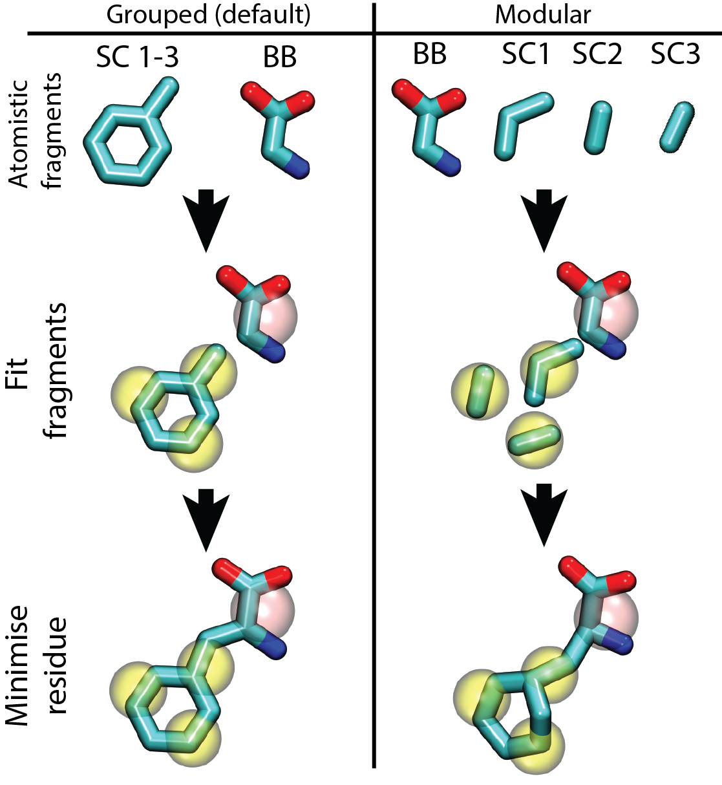

                                   <b>**CG2AT v2 README**</b>

If you are using CG2AT2 please acknowledge me (Dr Owen Vickery) and use the following citation.

Vickery ON, Stansfeld PJ. CG2AT2: an Enhanced Fragment-Based Approach for Serial Multi-scale Molecular Dynamics Simulations. J Chem Theory Comput. 2021 Oct 12;17(10):6472-6482. doi: 10.1021/acs.jctc.1c00295. Epub 2021 Sep 7. PMID: 34492188; PMCID: PMC8515810.

                                   <b>**CG2AT2 OVERVIEW**</b>

CG2AT2 is a fragment based conversion of coarse grain systems (e.g. martini) to atomistic. CG2AT2 generates a selection of outputs for allowing further refinements and analysis via atomistic simulations. 

CG2AT2 has been designed for ease of use, where for the majority of users need only supply the coordinate file of the coarsegrain system and the original atomisitc file. CG2AT2 will then provide all the files required to run the further atomistic simulation. 

                                   <b>**INSTALL**</b>

The best method to get a copy of CG2AT2 is via CONDA which will install the latest version of CG2AT2 including any missing packages already not installed. 

conda install -c stansfeld_rg cg2at

However, CG2AT2 does not require any real install and can be downloaded ready to run from either github or zenodo,

The addition of CG2AT to the system PATH is advisable for ease of use.

This following line can be added to the .profile or .bashrc file.

export PATH="path_to_CG2AT2:$PATH"

                                   <b>**REQUIREMENTS**</b>

                                     
Software:

- Python v3 or higher
- GROMACS > v5

Non standard python modules:

- Numpy
- Scipy

Standard modules included in base python install (ubuntu 18):

- argparse
- copy
- datetime
- difflib
- distutils
- glob
- math
- multiprocessing
- ntpath
- os
- pathlib
- re
- shutil
- string
- sys
- subprocess
- time

                                   <b>**FLAGS**</b>

                                        

REQUIRED

- -c          (pdb/gro/tpr)

OPTIONAL

- -a          (pdb/gro/tpr)
- -d          (0:2 1:2)
- -loc        (str)
- -o          ['all', 'align', 'de_novo', 'none']
- -group      (e.g. 0,1 2,3 or all or chain)
- -npcus      (int)
- -mod        (True/False)
- -sf         (float)(default=0.9)
- -cys        (float)
- -ter        (True/False)
- -nt         (True/False)
- -ct         (True/False)
- -vs         (True/False)
- -swap       (str)
- -box        (int) (Angstrom)(0 is ignored and uses input eg 100 150 100 ) 
- -w          (str)
- -ff         (str) 
- -fg         (str) 
- -gmx        (str) 
- -messy      (True/False) 
- -info       (True/False)
- -version    (True/False)
- -v          (-vvv) 
- -disre      (True/False)
- -ov         (float)
- -silent     (True/False)
- -posre      (str) 
- -compare    (str) 

                                   <b>**Fragment based fitting**</b>

  

This workflow allows each fragment to be treated individually, with no knowledge of what any other bead contains.

CG2AT2 roughly follows the following workflow.

- Center fragments based on the center of mass (COM) of heavy atoms.
- Rotate fragments to find minimum distance between the atoms connecting to other beads.
- Minimise residue
- Merge all residues and minimise
- check for threaded lipids
- Run NVT and NPT
- Morph protein to rigid body alignment

  

                                   <b>**threaded lipids**</b>

To correct for accidental threading of lipids tails through aromatic residues, CG2AT2 analyses the length of all bonds within the minimised system. If any bonds are greater than 0.2 nm the lipid is considered threaded. The atoms closest to the aromatic residue are then corrected and the system is minimised again.

  

                                   <b>**INPUT**</b>

CG2AT2 contains two methods to rebuild the system:

- de novo method, following the protocol described in the CG2AT2 overview section.
- flexible fitting of a user supplied atomistic structure (prefereably the one used to make the CG representation).

To run a basic conversion of your system, all that is required is the coarsegrain system in any format readable by "gmx editconf".

However, the quality of the conversion is improved if you can provide the starting atomistic structure used to create the initial CG model.

e.g.
<pre>
    python cg2at.py -c cg_input.gro -a atomistic_input.gro
</pre>

The atomistic segments are then aligned to the coarsegrain initially by sequence. The atomistic foles can be supplied in a single or multiple files 

If only partial structures are supplied, then CG2AT2 will build in the missing residues from the de novo build. 

For example if you have a signal peptide linked via a flexible linker to the main protein.

You can just supply the atomistic coordinates for the signal peptide and main protein and CG2AT2 will build in the linker from the de novo method.

  

                                   <b>**OUTPUT FILE STRUCTURE**</b>

                                        

CG2AT2 will create a output file system as below.

    | --    CG2AT_(timestamp)
                | --    INPUT
                                - CG_INPUT.pdb, AT_INPUT_X.pdb, script_inputs.dat
                | --    RESIDUE_TYPE (PROTEIN, POPE)
                                - converted indivudal residues
                | --    MERGED
                                -  merged residue types
                | --    FINAL
                                - Forcefield selected, all topology files, final conversions

Directories

- INPUT
  - supplied cg file (pdb,gro,tpr)
  - CG converted to pdb (CG_input.pdb)
  - supplied atomistic file (pdb,gro,tpr)
  - supplied atomistic file converted to pdb (AT_input_X.pdb)
  - script inputs, all flags used in the conversion saved for future reference

- RESIDUE_TYPE (e.g POPE, PROTEIN)
  - individual residues after initial conversion
  - topology for residues
  - mdp for minisation
  - gromacs outputs saved
  - MIN folder containing minimised residues
  - merged pdb containing all minimised residues in a single pdb
- MERGED
  - topology for all residues 
  - mdp for minisation
  - all residue types merged into single pdb 
  - gromacs outputs saved
  - MIN folder containing merged minimisation files
  - NVT folder containing merged NVT files
  - STEER folder containing merged aligned files
- FINAL
  - FORCEFIELD folder 
  - topology for all residues
  - final atomistic structures in pdb format
  - script timings for the conversion
  - final conversion RMSD between atomistic output and CG

<b>Rigid fitting</b>

                                        

If you are converting a multimeric protein, such as a potassium channel, the atomistic structure can be fitted in several ways:
<pre>

Default:
<b>individual atomistic chains are fitted to CG structure</b>

Fit by coarse grain chain:
<b>-group chain </b>

Fit entire atomistic structure rigidly:
<b>-group all </b>

Fit atomistic chains in specific groups:
Treat chains 0, 2 and 1, 3 as individual groups. Each group is separated by a space.
<b>-group 0,2 1,3   </b>
</pre>

                                   <b>Output conversions</b>

                                        

CG2AT2 provides 3 types of coarsegrain conversions. 

You can select which of these is supplied using the flag:
- -o ['all', 'align', 'de_novo', 'none']
<pre>

<b>none:</b>

- The atomistic framgents are fitted to the CG structure and minismised.
- Threaded lipids are fixed
- Final output is located FINAL/final_cg2at_de_novo.pdb

<b>de_novo:</b>

- The atomistic framgents are fitted to the CG structure and minismised.
- Threaded lipids are fixed
- Short 5 ps NVT simulation is run  
- Final output is located FINAL/final_cg2at_de_novo.pdb

<b>align:</b>

- The atomistic framgents are fitted to the CG structure and minismised.
- Threaded lipids are fixed
- Minimised de_novo is morphed by steered MD to the user supplied structure 
- Final output is located FINAL/final_cg2at_aligned.pdb

<b>all (default):</b>

- The atomistic framgents are fitted to the CG structure and minismised.
- Threaded lipids are fixed
- Short 5 ps NVT simulation is run  
- First output is located FINAL/final_cg2at_de_novo.pdb
- Final frame from NVT is morphed by steered MD to the user supplied structure 
- second output is located FINAL/final_cg2at_aligned.pdb
</pre>

                                   <b>**Automation**</b>

                                        
If you know in advance which settings you wish to use, these can be supplied by the following flags. 

- w   (str) water model         e.g. tip3p
- fg  (str) fragment databases  e.g. martini_2-2_charmm36
- ff  (str) forcefield          e.g. charmm36-jul2017

example input.

<pre>
    python cg2at.py -c cg_input.pdb -a atomistic_input.pdb -w tip3p -fg martini_2-2_charmm36 -ff charmm36-jul2017-update 
</pre>

                                   <b>**OTHER FLAGS**</b>

                                   <b>Disulphide Bonds</b>

                                        

CG2AT2 currently finds disulphide bonds in the user supplied atomistic structure (S-S < 2.1 A).

As well as searching the CG representation for disulphide bonds (SC1-SC1 < 7 A and more than 4 residues apart).

If the disulphide only exists in the CG, then CG2AT2 will ask if it is a disuphide. 

To silence the question and automatically select disulphides use the flag: 

- -silent

In most cases CG2AT2 catches the extra long disulphide bonds in martini simulations, however in some cases the disulphide can extend up to 10A.

If you recieve a error that the pdb and topology don't match and the atom number is out by 2. It is most likely a disulpide bond not being treated correctly.

You may be able to fix it by increasing the disulphide bond search radius catch using the flag:

- -cys (default = 7 A)

<b>Swap residues and beads</b>

                                        

Due to the modular nature of CG representation, you can switch beads and residues during the conversion if you wish to make simple mutations.

The swapping procedure is limited to residues with the same number or fewer CG beads, CG2AT2 cannot add extra beads. If you wish to add extra beads to residues, this can be done in the initial input file. 

<b>-swap </b> 

Usage

             From        :              To           :    range
      resname,bead,bead  :     resname,bead,bead     :  0-10,30-40

Examples: 

If the beads are the same:

swap all ASP to ASN:

<b>-swap ASP:ASN </b>

Swap ASP to ASN in the resid range 0-10 and 30-40:

<b>-swap ASP:ASN:0-10,30-40</b>

If the beads are different:

Switch residues with different beads:

<b>-swap POPC,NC3:POPG,GL0</b>

If you wish to switch within the same residue:

<b>-swap POPG,D2B:POPG,C2B</b>

To skip residues or beads:

To skip a bead.

<b>-swap GLU,SC2:ASP,skip</b>

To skip a residue.

<b>-swap POPG:skip</b>

Mutiple residues

The following switches all POPE to POPG and all POPG to POPE:

<b>-swap POPE,NH3:POPG,GL0 POPG,GL0:POPE,NH3</b>

The following will skip all NA+ between resid 4000 and 4100:

<b>-swap NA+:skip:4000-4100</b>

<b>Correcting residue name truncation</b>

Please note that currently the maximum residue name length is four characters in both pdb and gro files. 

This causes a lot of issues with highly similar residues such as Phosphatidylinositol (POPI) lipids, for example there are three versions of the PI headgroup (PI-3-P, PI-4-P, PI-5-P). All three of these residues are truncated to POPI, removing the phosphate position from the residue name.

Within CG2AT2 the residue names do not need to be four characters in length. For example, PI-3-P, PI-4-P, PI-5-P are called POPI1_3, POPI1_4 and POPI1_5 respectively.

By using the swap function, the POPI lipid can be switched with POPI1_4.

<pre>
<b>-swap POPI:POPI1_4</b>  
</pre>

the PIP2 lipid in martini has a -5 charge, however this can be switched to a range of possible phosphat positions and protonation states.

<pre>
lipid, number of PO4, PO4 position and PO4 protonation
e.g. Phosphatidylinositol 3,5-bisphosphate = POPI2_3-5

e.g. Different versions of phosphatidylinositol bisphosphate lipids 
POPI2_3-4_3   
POPI2_3-4_4
POPI2_3-5_3
POPI2_3-5_5
POPI2_3-5     
POPI2_4-5_4
POPI2_4-5_5
</pre>

                                   <b>Virtual sites</b>

To apply virtual sites to you protein use the flag:

<pre>
<b>-vs</b>
</pre>

                                   <b>Duplication</b>

If you are converting a homodimer, you only need to supply a single atomistic structure. With the duplication flag you can copy atomistic protein chains.

To duplicate chain 0 to create a total of 2 chains the following input can be used.  

e.g.
<pre>
<b>-d 0:2</b>
</pre>

                                   <b>location</b>

CG2AT2 will by default create a new directory each time it is run (CG2AT_timestamp) this can be overridden with the loc flag. 

If CG2AT2 fails a somepoint you can fix the offending error in the structure and you can rerun CG2AT2, which will pick up from where it left off.  

e.g.
<pre>
<b>-loc CG2AT</b>
</pre>

                                   <b>Number of CPUS</b>

CG2AT by default will attempt to parallise everything over 8 cores, this can be overridden with the ncpus flag.

e.g.
<pre>
<b>-ncpus 4</b>
</pre>

                                   <b>Modular vs group</b>

The individual fragments for a residue can be treated as a group (specified within the topology file), this lowers the risk of a failed conversion and improves the quality of the conversion. This is enabled by default.

Grouping can be switched off using the flag:
<pre>
<b>-mod</b>
</pre>

The grouping is especially useful for converting sugar groups in which the hydrogen geometry should be retained as much as possible.

  

                                   <b>Scale factor</b>

CG2AT2 by default shrinks the fragments to 90 % of the original size, this decreases the possibility of overlapping atoms. If the system has issues minimising the system, you can shrink the fragments further.

e.g. 80%
<pre>
<b>-sf 0.8</b>
</pre>

                                   <b>Terminal residues</b>

By default CG2AT2 uses charged termini on the protein chains, this due to some forcefield files being unable to add neutral termini. 

If the termini for the residue isn't supplied within the residue topology, then you can specify the termini type you require.

<pre>
All N-termini neutral
<b>-nt</b>

All C-termini neutral
<b>-ct</b>

Interactively choose termini
<b>-ter</b>
</pre>

                                   <b>PBC box resizing</b>

For the moment CG2AT2 only allows PBC box resizing for cubic boxs. The box flag controls the final box size and is measured in Angstroms. If you wish to shrink the box on selected axises replace the box vector with 0.

<pre>
Change box size to 100, 100, 100
<b>-box 100 100 100</b>
To shrink box on the z-axis only to 100 A
<b>-box 0 0 100</b>
</pre>

                                   <b>Specifing GROMACS version</b>

CG2AT2 will automatically try and find the installed version of GROMACS, however you can specify the specific install to use.

This is useful if you have two versions of GROMACS installed e.g. gmx and gmx_mod

<pre>
to use gmx_mod
<b>-gromacs gmx_mod</b>
</pre>

                                   <b>Cleaning</b>

CG2AT2 will by default clean as many temporary files from the conversion as possible, whilst leaving enough to rerun the script quickly.

To prevent the cleanup and retain all the temporary files use the messy flag.
<pre>
<b>-messy</b>
</pre>

                                   <b>Distance restraint matrix</b>

If you supply a atomistic file to CG2AT2, a distance restraint matrix will be generated for the protein backbone hydrogen bond network. This network is overlay on the de_novo conversion during the NVT simulation. This generally has minimal effect on the structure however improves the orientation of the backbone atoms.

This can be switched off using the disre flag.
<pre>
<b>-disre</b>
</pre>

                                   <b>Atom overlap checker</b>

CG2AT2 by default prevents atoms from overlapping within 0.3 Angstrom, any closer than this and minimisation is likely to fail. If you still generate minimisation errors increasing the overlap cutoff may fix it.

This can be controlled using the ov flag.
e.g. 0.5 Angstrom overlap
<pre>
<b>-ov 0.5</b>
</pre>

                                   <b>Further information</b>

If you require further information on CG2AT2 there are multiple flags that can be used.

<pre>
Help menu for flags
<b>-h</b>
Current version of CG2AT2
<b>-version</b>
Information on CG2AT including contact details, list of available fragments and forcefields.
<b>-info</b>
To find available residue fragments in a specific fragment database, you can use the fg in conjuction with the info flag.
<b>-info -fg martini_2-2_charmm36</b>
To change the verbosity of CG2AT2 the 'v' can be used, by increasing the number of flags, the verbosity can be modulated.
<b>-v -v or -vv</b>
</pre>

                                   <b>**Database**</b>

                                        

The database has the following file structure and is checked everytime CG2AT2 is run.

New forcefields and fragments can be added very easily by creating a new folder within the directory structure below. 

<pre>
    | -- database
                | -- scripts_files
                     - run files
                | -- forcefields
                     -  forcefield directories for gromacs (eg. charmm36.ff)
                | -- fragments
                     | -- forcefield type (eg. charmm36)
                          | -- protein
                               | -- Aminoacids (eg. ASP)
                                    - fragment pdb called the same as bead names (eg. ASP.pdb)
                                    - topology file (eg. ASP.top) (optional)
                          | -- protein_modified 
                               | -- modified residues (eg. CYSD) 
                                    - fragment pdb called the same as bead names (eg. CYSD.pdb)
                                    - topology file (eg. CYSD.top) (optional)            
                          | -- non_protein 
                               | -- non protein molecules (eg. lipids POPC)
                                    - fragment pdb called the same as residue names (eg. POPC.pdb)
                                    - itp file of residue called the same as residue names (eg. POPC.itp)
                                    - topology file (eg. POPC.top) (optional)
                          | -- solvent 
                               | -- solvent molecules (eg. W)
                                    - fragment pdb called the same as residue names (eg. TIP3P.pdb)
                                    - itp file of residue called the same as residue names (eg. TIP3P.itp)
                                    - topology file (eg. TIP3P.top) (optional)
                          | -- ions 
                               | -- ions types (eg. K)
                                    - fragment pdb called the same as residue names (eg. K.pdb)
                                    - itp file of residue called the same as residue names (eg. K.itp)
                                    - topology file (eg. K.top) (optional)
                          | -- other
                               | -- multi residue constructs (eg. DNA)
                                    - fragment pdb called the same as bead names (eg. DA.pdb)
                                    - topology file (eg. DA.top) (optional)
</pre>

You can prevent the script from reading any file or folder by prefixing the name with a underscore.

                                   <b>**Adding fragments to the database**</b>

The fragment database is separated into three parts (protein, non-protein and other).

Each fragment file contains the following flags:

<pre>
[ bead_name ]
atom 1
atom 5
atom 2
...
[ bead_name ]
atom 8
atom 9
...

</pre>

The protein section contains all the normal amino acids and post-translationally modified residues.

The normal amino acids fragments do not contain any adjustable hydrogens (e.g. aspartate), these are incorporated by pdb2gmx.

Whilst the modified protein and non protein fragments retain all their hydrogens. 

This is due to problematic adding of every residue to the gromacs hydrogen database. 

An example of a normal amino acid fragment files:

<pre>
Phenylalanine

[ BB ]
ATOM      1  N   PHE     1      42.030  16.760  10.920  2.00  0.00           N
ATOM      2  CA  PHE     1      42.770  17.920  11.410  3.00  1.00           C
ATOM     10  C   PHE     1      44.240  17.600  11.550  2.00  0.00           C
ATOM     11  O   PHE     1      44.640  16.530  12.080  6.00  0.00           O
[ SC1 ]
ATOM      3  CB  PHE     1      42.220  18.360  12.800  1.00  1.00           C
ATOM      4  CG  PHE     1      40.730  18.730  12.860  3.00  2.00           C
ATOM      5  CD1 PHE     1      39.780  17.730  13.110  1.00  4.00           C
[ SC2 ]
ATOM      8  CD2 PHE     1      40.300  20.030  12.600  1.00  2.00           C
ATOM      9  CE2 PHE     1      38.940  20.340  12.590  1.00  3.00           C
[ SC3 ]
ATOM      6  CE1 PHE     1      38.420  18.030  13.090  1.00  4.00           C
ATOM      7  CZ  PHE     1      38.000  19.330  12.830  1.00  3.00           C
</pre>

The optional topology file contains the information about grouping and connectivity

<pre>
[ CONNECT ]
# bead_1 atom_1 bead_2 direction
   BB      N      BB       -1
   BB      C      BB        1

[ GROUPS ]
SC1 SC2 SC3

[ CHIRAL ]
# column must be in the order:
# central atom, atom to move, atom_1, atom_2, atom_3
# eg: CA HA CB N C
CA HA CB N C

</pre>

For non protein residues you can create a position restraint file which is applied during the creation of the aligned.

cg2at can create a posres file for the molecule with the flag "-posre"

<pre>
cg2at -posre POPE.pdb -fg martini_2-2_charm36
</pre>

In the case of solvent. each water type is contained within the bead folder e.g solvent/W/TIP3P.pdb, solvent/W/SPCE.pdb

In martini water, multiple atomistic water molecules are condensed into a single bead, therefore the fragment can multiple molecules.

<pre>
[ TIP3P ]
ATOM      1  OW  SOL     1      20.910  21.130  75.300  1.00  0.00
ATOM      2  HW1 SOL     1      20.580  21.660  76.020  1.00  0.00
ATOM      3  HW2 SOL     1      21.640  21.640  74.940  1.00  0.00
ATOM      4  OW  SOL     2      21.000  22.960  77.110  1.00  0.00
ATOM      5  HW1 SOL     2      21.390  23.220  76.270  1.00  0.00
ATOM      6  HW2 SOL     2      21.450  22.160  77.360  1.00  0.00
ATOM      7  OW  SOL     3      22.650  23.020  75.080  1.00  0.00
ATOM      8  HW1 SOL     3      22.830  22.410  75.790  1.00  0.00
ATOM      9  HW2 SOL     3      23.510  23.340  74.810  1.00  0.00
ATOM     10  OW  SOL     4      22.890  21.190  76.980  1.00  0.00
ATOM     11  HW1 SOL     4      22.130  20.970  76.440  1.00  0.00
ATOM     12  HW2 SOL     4      23.090  20.380  77.460  1.00  0.00
</pre>

In the case of ions only the ion is stored as a fragment. 

<pre>
[ NA+ ]
ATOM      1  NA   NA     1      21.863  22.075  76.118  1.00  0.00
</pre>

During the conversion a water bead is superimposed over the ion, to replace the hydration shell of the ion.

This is controlled by the topology file. The Hydration section contains the solvent bead to overlay if specified.
<pre>
[ HYDRATION ]
W
</pre>
