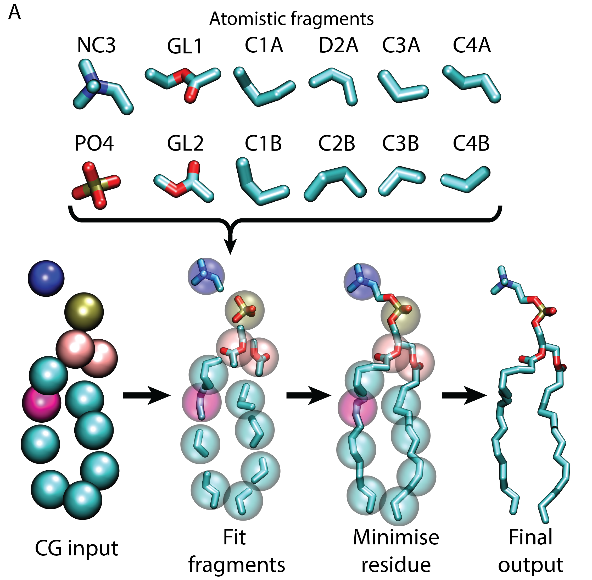

                                   <b>**CG2AT v2 README**</b>

If you are using this script please acknowledge me (Dr Owen Vickery) and cite the following DOI.

DOI: 10.5281/zenodo.3890163

                                   <b>**CG2AT SCRIPT OVERVIEW**</b>

The script is a fragment based conversion of  coarse grain systems such as martini to atomistic. This method generates a selection of outputs for further refinement and analysis via atomistic simulations. 

CG2AT2 has been designed for ease of use, where for the majority of users only only need to supply the coordinate file of the coarsegrain system and the original atomisitc file. CG2AT2 will provide all the files required to run the further atomistic simulation. 

                                   <b>**REQUIREMENTS**</b>

                                     
Software:

- Python v3 or higher
- GROMACS > v5

Non standard python modules:

- Numpy
- Scipy

Standard modules included in base python install (ubuntu 18):

- argparse
- copy
- datetime
- difflib
- distutils
- glob
- math
- multiprocessing
- ntpath
- os
- pathlib
- re
- shutil
- string
- sys
- subprocess
- time

                                   <b>**FLAGS**</b>

                                        

REQUIRED

- -c          (pdb/gro/tpr)

OPTIONAL

- -a          (pdb/gro/tpr)
- -d          (0:2 1:2)
- -loc        (str)
- -o          ['all', 'align', 'de_novo', 'none']
- -group      (e.g. 0,1 2,3 or all or chain)
- -npcus      (int)
- -mod        (True/False)
- -sf         (float)(default=0.9)
- -swap       (str)
- -cys        (float)
- -ter        (True/False)
- -nt         (True/False)
- -ct         (True/False)
- -al         (True/False)
- -vs         (True/False)
- -swap       (str)(e.g. PIP2,D3A:PIP2,C3A GLU,SC2:ASP,skip)
- -box        (int) (Angstrom)(0 is ignored and uses input eg 100 150 100 ) 
- -w          [tip3p, tip4p, spc and spce] 
- -ff         (str) 
- -fg         (str) 
- -gromacs    (str) 
- -messy      (True/False) 
- -info       (True/False)
- -version    (True/False)
- -v          (-vvv) 
- -disre      (True/False)
- -ov         (float)

                                   <b>**Fragment based fitting**</b>

  

This workflow allows each fragment to be treated individually, with no knowledge of what any other bead contains.

This script roughly follows the following workflow.

- Center fragments based on the center of mass (COM) of heavy atoms.
- Rotate fragments to find minimum distance between the atoms connecting to other beads.
- Minimise residue
- Merge all residues and minimise
- check for abnormal bonds (marker for lipid through rings)
- Run NVT and NPT
- Morph protein to either rigid body alignment

  

                                   <b>**INPUT**</b>

The script contains two methods to rebuild the system:

- de novo method, following the protocol described in the script overview section.
- flexible fitting of a user supplied atomistic structure (prefereably the one used to make the CG representation).

To run a basic conversion of your system, all that is required is the coarsegrain system in any format readable by "gmx editconf".

However, the quality of the conversion is improved if you can provide the starting atomistic structure used to create the initial CG model.

The atomistic segments are then aligned to the coarsegrain initially by sequence. The atomistic foles can be supplied in a single or multiple files 

If only partial structures are supplied, then the script will build in the missing residues from the de novo build. 

For example if you have a signal peptide linked via a flexible linker to the main protein.

You can just supply the atomistic coordinates for the signal peptide and main protein and the script will build in the linker from the de novo method.

the script will rigid body fit the helix and cytosolic protein separately and fill in the linker from the de novo construct. 

<pre>
                              CG                        AT from user
    input            helix --------- protein           helix, protein 
                               |                             |
                               V                             |
    conversion       helix --------- protein                 |
     (de novo)                 |                             |
                               V                             V
          de novo: linker  ---------            user:   helix, protein
                                    \                  /
                                     \________________/
                                             |
                                             V
    final hybrid system            helix --------- protein
</pre>

e.g.
<pre>
    python cg2at.py -c cg_input.gro -a atomistic_input.gro
</pre>

                                   <b>**Advanced Usage**</b>

                                   <b>Virtual sites</b>

To apply virtual sites to you protein use the flag:

- -vs

                                   <b>Disulphide Bonds</b>

                                        

The script currently finds disulphide bonds in the user supplied atomistic structure (S-S < 2.1 A).

As well as searching the CG representation for disulphide bonds (SC1-SC1 < 7 A and more than 4 residues apart).

If the disulphide only exists in the CG, then the script will ask if it is a disuphide. 

To silence the question and automatically select disulphides use the flag: 

- -silent

In most cases the script catches the extra long disulphide bonds in martini simulations, however in some cases the disulphide can extend up to 10A.

If you recieve a error that the pdb and topology don't match and the atom number is out by 2. It is most likely a disulpide bond not being treated correctly.

You may be able to fix it by increasing the disulphide bond search radius catch using the flag:

- -cys (default = 7 A)

<b>Rigid fitting</b>

                                        

If you are converting a multimeric protein, such as a potassium channel. You can fit the atomistic structure in several ways:
<pre>

Default:
<b>individual atomistic chains are fitted to CG structure</b>

Fit by coarse grain chain:
<b>- -group chain </b>

Fit entire atomistic structure rigidly:
<b>- -group all </b>

Fit atomistic chains in specific groups:
Treat chains 0, 2 and 1, 3 as individual groups. Each group is separated by a space.
<b>- -group 0,2 1,3   </b>
</pre>

<b>Swap residues and beads</b>

                                        

Due to the modular nature of CG representation, you can switch residues during the conversion if you wish to make simple mutations.

If the residue you are swapping to has the same number or fewer CG beads you can use the following flag to change the residue.

<b>- -swap </b> 

Usage

             From        :              To           :    range
      resname,bead,bead  :     resname,bead,bead     :  0-10,30-40

Examples: 

If the beads are the same:

swap all ASP to ASN:

<b>-swap ASP:ASN </b>

Swap ASP to ASN in the resid range 0-10 and 30-40:

<b>-swap ASP:ASN:0-10,30-40</b>

If the beads are different:

Switch residues with different beads:

<b>-swap POPC,NC3:POPG,GL0</b>

If you wish to switch within the same residue:

<b>-swap POPG,D2B:POPG,C2B</b>

To skip residues or beads:

To skip a bead.

<b>-swap GLU,SC2:ASP,skip</b>

To skip a residue.

<b>-swap POPG:skip</b>

Mutiple residues

The following switches all POPE to POPG and all POPG to POPE:

<b>-swap POPE,NH3:POPG,GL0 POPG,GL0:POPE,NH3</b>

The following will skip all NA+ between resid 4000 and 4100:

<b>-swap NA+:skip:4000-4100</b>

                                   <b>**OUTPUT**</b>

                                        

The script will create a output file system as below.

    | --    CG2AT_(timestamp)
                | --    INPUT
                                - CG_INPUT.pdb, AT_INPUT_X.pdb, script_inputs.dat
                | --    RESIDUE_TYPE (PROTEIN, POPE)
                                - converted indivudal residues
                | --    MERGED
                                -  merged residue types
                | --    FINAL
                                - Forcefield selected, all topology files, final conversions

Directories

- INPUT
  - supplied cg file (pdb,gro,tpr)
  - CG converted to pdb (CG_input.pdb)
  - supplied atomistic file (pdb,gro,tpr)
  - supplied atomistic file converted to pdb (AT_input_X.pdb)
  - script inputs, all flags used in the conversion saved for future reference

- RESIDUE_TYPE (e.g POPE, PROTEIN)
  - individual residues after initial conversion
  - topology for residues
  - mdp for minisation
  - gromacs outputs saved
  - MIN folder containing minimised residues
  - merged pdb containing all minimised residues in a single pdb
- MERGED
  - topology for all residues 
  - mdp for minisation
  - all residue types merged into single pdb 
  - gromacs outputs saved
  - MIN folder containing merged minimisation files
  - NVT folder containing merged NVT files
  - STEER folder containing merged aligned files
- FINAL
  - FORCEFIELD folder 
  - topology for all residues
  - final atomistic structures in pdb format
  - script timings for the conversion
  - final conversion RMSD between atomistic output and CG

                                   <b>Output conversions</b>

                                        

The script provides 3 types of coarsegrain conversions. 

You can select which of these is supplied using the flag:
- -o ['all', 'align', 'de_novo', 'none']

<b>none:</b>

- The atomistic framgents are fitted to the CG structure and minismised.
- Threaded lipids are fixed
- Final output is located FINAL/final_cg2at_de_novo.pdb

<b>de_novo:</b>

- The atomistic framgents are fitted to the CG structure and minismised.
- Threaded lipids are fixed
- Short 5 ps NVT simulation is run  
- Final output is located FINAL/final_cg2at_de_novo.pdb

<b>align:</b>

- The atomistic framgents are fitted to the CG structure and minismised.
- Threaded lipids are fixed
- Minimised de_novo is morphed by steered MD to the user supplied structure 
- Final output is located FINAL/final_cg2at_aligned.pdb

<b>all (default):</b>

- The atomistic framgents are fitted to the CG structure and minismised.
- Threaded lipids are fixed
- Short 5 ps NVT simulation is run  
- First output is located FINAL/final_cg2at_de_novo.pdb
- Final frame from NVT is morphed by steered MD to the user supplied structure 
- second output is located FINAL/final_cg2at_aligned.pdb

                                   <b>**Automation**</b>

                                        
If you know in advance which settings you wish to use, these can be supplied by the following flags. 

- w   (str) water model         e.g. tip3p
- fg  (str) fragment databases  e.g. martini_2-2_charmm36
- ff  (str) forcefield          e.g. charmm36-jul2017

example input.

<pre>
    python cg2at.py -c cg_input.pdb -a atomistic_input.pdb -w tip3p -fg martini_2-2_charmm36 -ff charmm36-jul2017-update 
</pre>

                                   <b>**Database**</b>

                                        

The database has the following file structure and is checked everytime the script is run.

New forcefields and fragments can be added very easily by creating a new folder within the directory structure below. 

<pre>
    | -- database
                | -- scripts_files
                     - run files
                | -- forcefields
                     -  forcefield directories for gromacs (eg. charmm36.ff)
                | -- fragments
                     | -- forcefield type (eg. charmm36)
                          | -- protein
                               | -- Aminoacids (eg. ASP)
                                    - fragment pdb called the same as bead names (eg. ASP.pdb)
                                    - topology file (eg. ASP.top) (optional)
                               | -- MOD
                                    | -- modified residues (eg. CYSD) 
                                         - fragment pdb called the same as bead names (eg. CYSD.pdb)
                                         - topology file (eg. CYSD.top) (optional)            
                          | -- non_protein 
                               | -- non protein molecules (eg. lipids POPC)
                                    - fragment pdb called the same as residue names (eg. POPC.pdb)
                                    - itp file of residue called the same as residue names (eg. POPC.itp)
                                    - topology file (eg. POPC.top) (optional)
                          | -- other
                               | -- multi residue constructs (eg. DNA)
                                    - fragment pdb called the same as bead names (eg. DA.pdb)
                                    - topology file (eg. DA.top) (optional)
</pre>

You can prevent the script from reading any file or folder by prefixing the name with a underscore.

                                   <b>**Fragments**</b>

The fragment database is separated into three parts (protein, non-protein and other).

Each fragment file contains the following flags:

<pre>
[ bead_name ]
atom 1
atom 5
atom 2
...
[ bead_name ]
atom 8
atom 9
...

</pre>

The protein section contains all the normal amino acids and post-translationally modified residues.

The normal amino acids fragments do not contain any adjustable hydrogens (e.g. aspartate), these are incorporated by pdb2gmx.

Whilst the modified protein and non protein fragments retain all their hydrogens. 

This is due to problematic adding of every residue to the gromacs hydrogen database. 

multiple fragments can be treated as a group (specified within the topology file), this lowers the risk of a failed conversion and improves the quality of the conversion. 

This default grouping can be switched off using the flag:

- -mod

The grouping is especially useful for converting sugar groups in which the hydrogen geometry should be retained as much as possible.

  

An example of a normal amino acid fragment files:

<pre>
Phenylalanine

[ BB ]
ATOM      1  N   PHE     1      42.030  16.760  10.920  2.00  0.00           N
ATOM      2  CA  PHE     1      42.770  17.920  11.410  3.00  1.00           C
ATOM     10  C   PHE     1      44.240  17.600  11.550  2.00  0.00           C
ATOM     11  O   PHE     1      44.640  16.530  12.080  6.00  0.00           O
[ SC1 ]
ATOM      3  CB  PHE     1      42.220  18.360  12.800  1.00  1.00           C
ATOM      4  CG  PHE     1      40.730  18.730  12.860  3.00  2.00           C
ATOM      5  CD1 PHE     1      39.780  17.730  13.110  1.00  4.00           C
[ SC2 ]
ATOM      8  CD2 PHE     1      40.300  20.030  12.600  1.00  2.00           C
ATOM      9  CE2 PHE     1      38.940  20.340  12.590  1.00  3.00           C
[ SC3 ]
ATOM      6  CE1 PHE     1      38.420  18.030  13.090  1.00  4.00           C
ATOM      7  CZ  PHE     1      38.000  19.330  12.830  1.00  3.00           C
</pre>

The optional topology file contains the information about grouping and connectivity

<pre>
[ CONNECT ]
# bead_1 atom_1 bead_2 direction
   BB      N      BB       -1
   BB      C      BB        1
[ GROUPS ]
SC1 SC2 SC3
[ CHIRAL ]
# column must be in the order:
# central atom, atom to move, atom_1, atom_2, atom_3
# eg: CA HA CB N C
CA HA CB N C

</pre>

For non protein residues you can create a position restraint file which is applied during the creation of the aligned and steered systems.
A script exists within the scripts directory called make_fragments_posre.py this can either create the correct posre files for every residue in the system or for a single residue.

To apply to every folder in directory in non_protein:
<pre>
python make_fragments_posre.py -dir
</pre>
To apply to a single residue:
<pre>
python make_fragments_posre.py -f POPE.itp
</pre>

In the case of solvent. All ions and water molecules are in single repective pdb files with separate groups.

In martini water, 4 atomistic water molecules are condensed into a single bead, therefore the fragment has 4 water molecules.

<pre>
[ tip3p ]
ATOM      1  OW  SOL     1      20.910  21.130  75.300  1.00  0.00
ATOM      2  HW1 SOL     1      20.580  21.660  76.020  1.00  0.00
ATOM      3  HW2 SOL     1      21.640  21.640  74.940  1.00  0.00
ATOM      4  OW  SOL     2      21.000  22.960  77.110  1.00  0.00
ATOM      5  HW1 SOL     2      21.390  23.220  76.270  1.00  0.00
ATOM      6  HW2 SOL     2      21.450  22.160  77.360  1.00  0.00
ATOM      7  OW  SOL     3      22.650  23.020  75.080  1.00  0.00
ATOM      8  HW1 SOL     3      22.830  22.410  75.790  1.00  0.00
ATOM      9  HW2 SOL     3      23.510  23.340  74.810  1.00  0.00
ATOM     10  OW  SOL     4      22.890  21.190  76.980  1.00  0.00
ATOM     11  HW1 SOL     4      22.130  20.970  76.440  1.00  0.00
ATOM     12  HW2 SOL     4      23.090  20.380  77.460  1.00  0.00
[ tip4p ]
ATOM      1  OW  SOL     1      38.680  58.360  49.620  1.00  0.00
ATOM      2  HW1 SOL     1      37.800  58.250  49.280  1.00  0.00
ATOM      3  HW2 SOL     1      38.580  58.980  50.350  1.00  0.00
ATOM      4  MW  SOL     1      38.560  58.430  49.670  1.00  0.00
ATOM      5  OW  SOL     2      36.110  58.430  49.680  1.00  0.00
ATOM      6  HW1 SOL     2      36.530  59.190  50.080  1.00  0.00
ATOM      7  HW2 SOL     2      36.480  57.680  50.140  1.00  0.00
ATOM      8  MW  SOL     2      36.210  58.430  49.790  1.00  0.00
ATOM      9  OW  SOL     3      37.520  59.880  51.350  1.00  0.00
ATOM     10  HW1 SOL     3      37.430  58.950  51.530  1.00  0.00
ATOM     11  HW2 SOL     3      37.480  60.300  52.210  1.00  0.00
ATOM     12  MW  SOL     3      37.500  59.810  51.480  1.00  0.00
ATOM     13  OW  SOL     4      37.410  57.240  51.590  1.00  0.00
ATOM     14  HW1 SOL     4      37.960  57.460  50.840  1.00  0.00
ATOM     15  HW2 SOL     4      37.630  56.330  51.790  1.00  0.00
ATOM     16  MW  SOL     4      37.510  57.150  51.520  1.00  0.00
</pre>

In the case of ions only the ion is stored as a fragment. During the conversion a water bead is superimposed over the ion, to replace the hydration shell of the ion.

<pre>
[ NA+ ]
ATOM      1  NA   NA     1      21.863  22.075  76.118  1.00  0.00
[ NA ]
ATOM      1  NA   NA     1      21.863  22.075  76.118  1.00  0.00
</pre>
